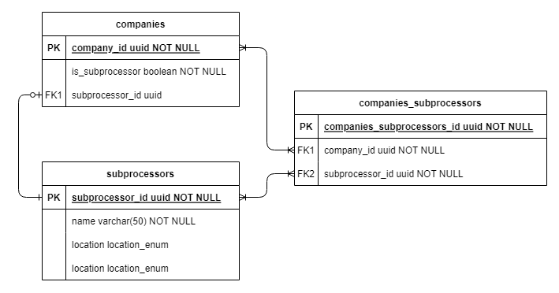

# Data Model

The following is an Entity-Relationship Diagram of a possible implementation of the previously detailed project.

<p align="center">
	
</p>

This assumes the following:

- Once a company adds a subprocessor, all other companies are able to add them to their own list of subprocessors.
- If any company updates a subprocessor entry, the update will be reflected on all other tables where said subprocessor is included. (Following the `"Single source of truth"` that was required.
- The only fields that were considered to be unique are each table's ID's.
	- Subprocessors can have same names in this instance. If it were desired for all subprocessor names to be unique, further parameters (casing, whitespace consideration, special characters, etc) and string checking could be implemented.

## Exaple walkthrough

Some standard processes with this data model would be :

1. A `company` is created. (`Company A`) for this example.

	1. An entry is added to the `companies` table.
	2. If the company was marked as a subprocessor when created, an entry to the `subprocessors` table is added, including all the corresponding field values (`name`, `location`, `purpose`).
	3. The ID of said entry is set to the `subprocessor_id` field of the initial `companies` entry.

2. `Company A` adds a new subprocessor to their list

	1. An entry to the `subprocessors` table is added, containing all values.
	2. An entry to the `companies_subprocessors` table is added, containing the `company_id` value and the new `subprocessor_id` values.

### Additional Notes

1. Field `location` inside the `subprocessors` table will use a defined enum, which could be defined as such:

	```ts
	enum Location {
	  canada = "Canada",
	  mexico = "Mexico",
	  usa = "USA",
	  england = "England",
	  // ...
	}
	```
2. Similarly, field `purpose` inside the `subprocessors` table will use a defined enum:

	```ts
	enum Purpose {
	  cdn = "CDN",
	  hosting = "Hosting",
	  emailDeliverability = "Email Deliverability",
	  // ...
	}
	```
